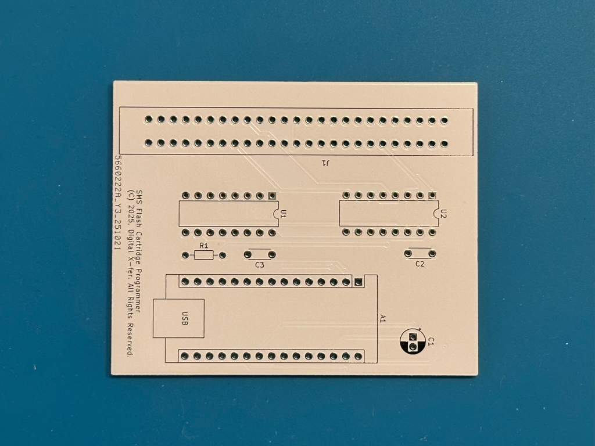
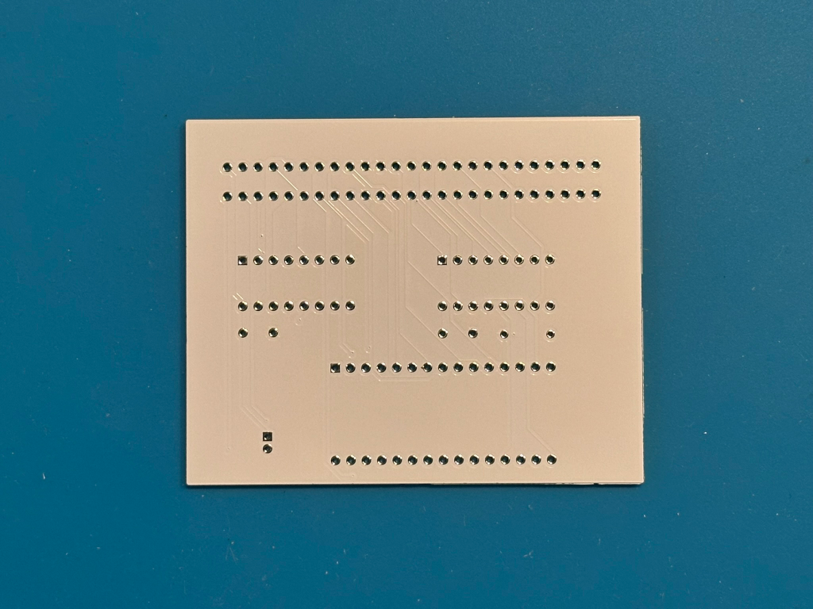
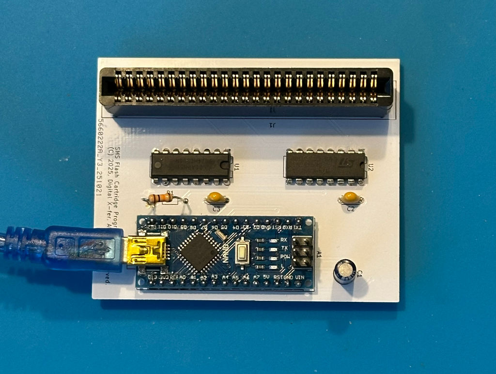

# SEGA Master System Flash Cartridge Programmer

This flash cartridge programmer is based on an Arduino NANO and is compatible with
[Ichigobankai's SMS flash cart PCB](https://github.com/ichigobankai/SMS_PCB_SLOT1-2_2GAL_DIP).

The Arduino UART is configured for 2,000,000 baud and is used to interface with the user via terminal program such as ExtraPutty, or minicom, etc.

Downloading or uploading cartridge data is achieved using the XMODEM or XMODEM-1K transfer protocol.

Current user options allow for upload/download of cartridge data. Read/write a byte in the cartridge. Erase and blank-check the flash. Verify flash data with CRC32.

## Cartridge Interface

The cartridge interface is very simple, comprising of the following signals.

* A0-A15 - address bus to the cartridge connector
* D0-D7 - bidirectional data bus to/from the cartridge
* _CE - chip enable (active low)
* _RD - read (active low)
* _WR - write (active low)

A0-A15 are driven through the 74HC595 shift registers which are connected to the Arduino SPI interface. D0-D7, _CE, _RD, _WR and the shift-register parallel clock are driven directly from Arduino I/O pins.

## PCB Manufacturing

A zip file containing the GERBERs can be found in the GERBER directory. This zip file can be uploaded to [JLCPCB](https://jlcpcb.com) or [PCBWAY](https://pcbway.com) for manufacturing.

I also have some spares for sale if you don't want to manufacture a full batch. Follow [this link](https://www.ebay.com/itm/297757554009) to eBay.

## Bill of Materials (BOM)

The following parts are needed to populate the board. All parts should be available from AliExpress, DigiKey, etc.

|PCB |Qty.|Desc.| 
|----|----|-----|
|C2,C3| 2  | 0.1uF 50V capacitor |
|C1   | 1  | 22uF 6.3V capacitor | 
|R1   | 1  | 10K resistor        |
|U1,U2| 2  | SN74HC595           |
|A1   | 1  | Arduino NANO v3     |
|J1   | 1  | 2x25 female edge connector |

## Flash Cartridge Support

The current Arduino source code supports the flash cart from the link below when populated with an SST39SF040 flash device from Microchip Technology. This cart includes a basic memory mapper compatible with the standard SEGA cart mapper using slots 1&2.

https://github.com/ichigobankai/SMS_PCB_SLOT1-2_2GAL_DIP
